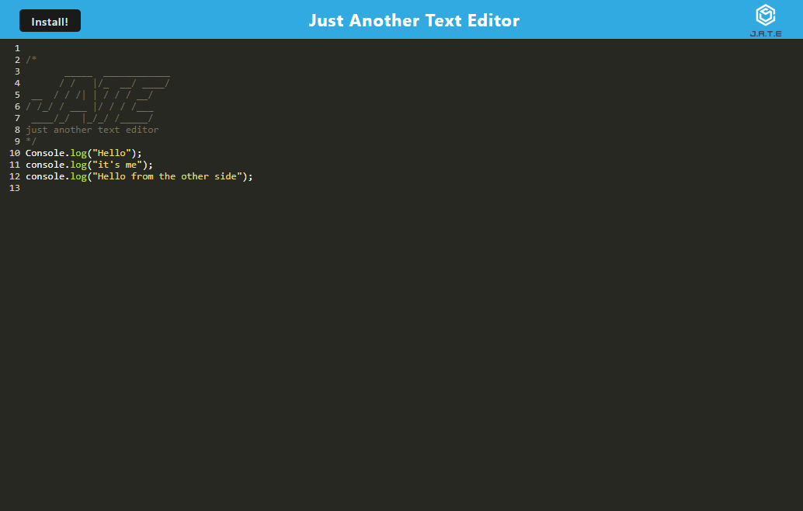

# PWA_text-editor

## Description

In this assignment, we are tasked with building a progressive web application (PWA), an application built using web platform technologies, while also providing a platform specific user experience.

## Installation

This application is meant to be deployed on Heroku (I had trouble deploying)

[Node.js](https://nodejs.org/en) is required to run this application. Between v16 and v18 is recommended.

The following commands we done via terminal: 

- `npm install` to install all necessary packages
- `npm run start` runs the build and starts the server

## Usage

## License

Refer to the license in the repository